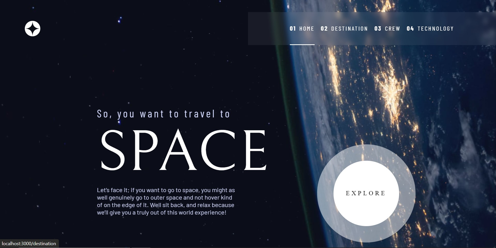
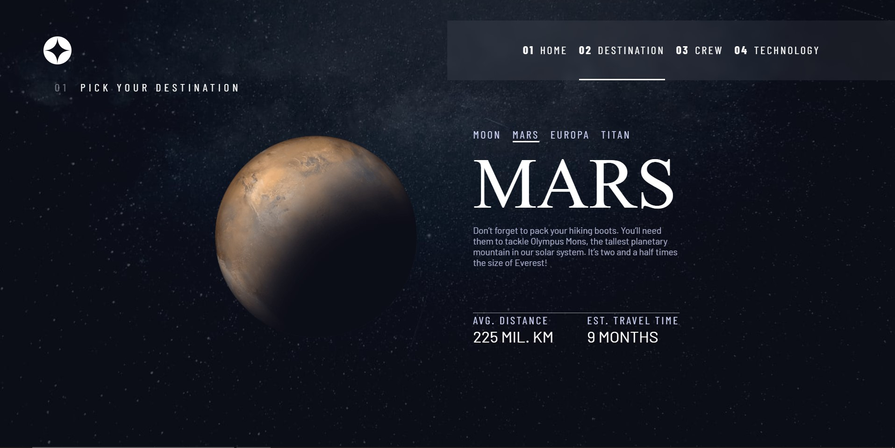
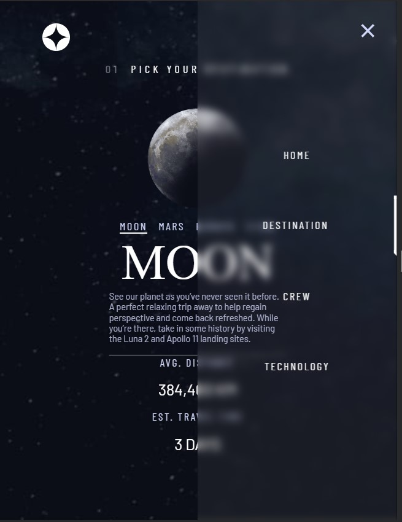

# Space Tourism Application

This is a solution to the [Space-Tourism-Application](https://www.frontendmentor.io/challenges/space-tourism-multipage-website-gRWj1URZ3). Frontend Mentor challenges help you improve your coding skills by building realistic projects. 

## Table of contents

- [Overview](#overview)
  - [The challenge](#the-challenge)
  - [Screenshot](#screenshot)
  - [Links](#links)
- [My process](#my-process)
  - [Built with](#built-with)
  - [What I learned](#what-i-learned)
  - [Continued development](#continued-development)
  - [Useful resources](#useful-resources)
- [Author](#author)
- [Acknowledgments](#acknowledgments)

## Overview

### The challenge

Users should be able to:

- View the optimal layout for the app depending on their device's screen size
- Interact with the application
- Enjoy the app 😁

### Screenshot
Following are few screenshots, view the full app to enjoy your ride....

### Links

- Solution URL: [Solution url](https://github.com/zohaibxJackie/Space-Tourism-Application)
- Live Site URL: [live site URL](https://zohaibxjackie.github.io/Space-Tourism-Application/)

## My process

### Built with

- Html 5
- Vanilla CSS
- Desktop-first workflow
- [React](https://reactjs.org/) - JS library

### What I learned
By building this application, I learned a lot about React. I learned how to manage layouts for different devices, and I learned how to manage different images based on sizes. I learned routing which is an important concept in react. Really enjoyed the process of building this application.

### Continued development

Although, I have learned a lot from this project but there are still many areas where I need improvements.

### Useful resources

- [Kevinn Powell](https://youtu.be/HbBMp6yUXO0?si=BM2JNafBn0UwmIdK) - This helped me with building amazing nav bar. I really liked this video. I really recommend watching this video, it will help in a lot of areas in future.

## Author

- Website - [Muhammad Zohaib](https://muhammadzohaib4.wordpress.com/)
- Frontend Mentor - [@zohaibxJackie](https://www.frontendmentor.io/profile/zohaibxJackie)
- Linkedin - [@MuhammadZohaib](www.linkedin.com/in/muhammad-zohaib-a42923316)
- Instagram - [@muhammadzohaibofficial1](https://www.instagram.com/muhammadzohaibofficial1?igsh=bHQwN3FoMm5idXd2)

## Acknowledgments

I would like to thank [@FrontendMentor](https://www.frontendmentor.io/) for giving me this opportunity to improve myself, and also for sharing these resources for free. Your guidence have been greatly appreciated.
